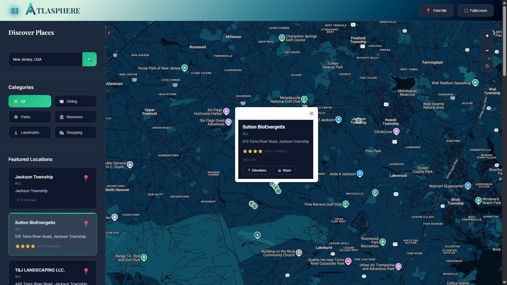

<div align="center"></div>

# <div align="center">ATLASPHERE</div>

**Atlasphere** is an intuitive web application designed to help users discover and explore locations on a map with various filtering and search functionalities. It features an immersive user interface and offers a range of capabilities from basic location discovery to searching for specific places and getting directions, all within a visually engaging and interactive environment.

---

## 🚀 Live Demo

Experience Atlasphere live here: 
👉 [](https://eccentriccoder01.github.io/Atlasphere)

 <div align="center">
 <p>

[](https://github.com/ellerbrock/open-source-badges/)


 </p>
 </div>

## 📸 Screenshots

<div align="center"></div>

---

### 💡 Core Functionalities (Map Interaction & Display)

* **Dynamic Map Loading**: The map initialises with a default view of New York City and loads seamlessly upon application start.
* **Custom Map Styling**: The map uses a custom dark theme, providing a visually distinct and appealing aesthetic.
* **Zoom Controls**: Users can easily zoom in and out of the map using dedicated controls, allowing for detailed or broad views.
* **Reset View**: A "Reset View" button allows users to quickly return to the initial default map view (New York City) and zoom level.
* **User Location**: The "Find Me" feature leverages geolocation to pinpoint and display the user's current location on the map.
* **Custom Markers**: Locations are represented by custom markers on the map, with icons and colors that vary based on their category (e.g., restaurants, parks, museums).
* **Interactive Info Windows**: Clicking on a marker opens an informative pop-up displaying the location's name, category, description, rating, and relevant actions like "Directions" and "Share".

### 🌐 Location Discovery & Management

* **Preloaded Locations**: The application comes with a predefined set of New York City locations, categorized for easy Browse.
* **Categorised Filtering**: Users can filter locations by predefined categories such as "Dining," "Parks," "Museums," "Landmarks," and "Shopping," to narrow down their search.
* **Search Functionality**: A search bar allows users to search for specific places, utilizing Google Places Autocomplete for suggestions and accurate location finding.
* **Nearby Places Search**: After a search or filter, the map dynamically fetches and displays nearby places based on the current map center and active category, enhancing discovery.
* **Location Cards**: Filtered and loaded locations are displayed in a scrollable sidebar as interactive cards, providing a quick overview of each place.
* **Focus on Location**: Clicking a location card in the sidebar will pan the map to that location and open its corresponding info window, providing a seamless user experience.

### 🎨 User Interface & Experience

Atlasphere provides a visually rich and responsive user interface:

* **Fullscreen Mode**: Users can toggle fullscreen mode for an immersive map viewing experience.
* **Responsive Design**: The application's layout adapts to different screen sizes, with the sidebar collapsing automatically on smaller screens for optimal viewing.
* **Sidebar Toggle**: A dedicated button allows users to manually collapse or expand the sidebar, giving them control over the interface layout.
* **Loading Overlay**: A visually appealing loading overlay with a spinner and message is displayed while the application initializes, improving perceived performance.
* **Toast Notifications**: Non-intrusive toast messages provide real-time feedback to the user for actions like map loading, location found, or errors.
* **Interactive UI Elements**: Buttons and search inputs have clear hover states and focus styles for improved usability.
* **Location Statistics**: A stats panel on the map displays the total number of locations currently shown and the number of active filters, providing useful at-a-glance information.

---

## 🛠️ Technology Stack

Atlasphere is built using a combination of standard web technologies and the powerful Google Maps Platform.


---

## ⚙️ Setup Instructions

To run Sagnik's Atlasphere:

### 1. Clone the Repository

```bash
git clone [https://github.com/eccentriccoder01/Atlasphere.git](https://github.com/eccentriccoder01/Atlasphere.git) # Assuming a repo named Atlasphere
cd Atlasphere
````

### 2\. Install Dependencies

Each folder (`js`, `styles`, `favicon`, etc.) is client-side. You can serve the project using any local server (e.g. `Live Server` in VSCode or Python's HTTP server):

```bash
npx live-server .
```
-----

## 🚧 Roadmap & Future Enhancements

  * [ ] Integrate more diverse data sources for locations.
  * [ ] Implement user reviews and ratings functionality.
  * [ ] Add routing and navigation features within the map.
  * [ ] Introduce user accounts and personalized saved locations.
  * [ ] Enhance search with more advanced filters and sorting options.
  * [ ] Improve performance for larger datasets.

---

## Issue Creation ✴

Report bugs and issues or propose improvements through our GitHub repository's "Issues" tab.

## Contribution Guidelines 📑

- Firstly Star(⭐) the Repository
- Fork the Repository and create a new branch for any updates/changes/issue you are working on.
- Start Coding and do changes.
- Commit your changes
- Create a Pull Request which will be reviewed and suggestions would be added to improve it.
- Add Screenshots and updated website links to help us understand what changes is all about.

- Check the [CONTRIBUTING.md](CONTRIBUTING.md) for detailed steps...

## Contributing is fun🧡

We welcome all contributions and suggestions!
Whether it's a new feature, design improvement, or a bug fix - your voice matters 💜

Your insights are invaluable to us. Reach out to us team for any inquiries, feedback, or concerns.

## 📄 License

This project is open-source and available under the MIT License.

## 📞 Contact

Developed by [Eccentric Explorer](https://eccentriccoder01.github.io/Me)

Feel free to reach out with any questions or feedback\!